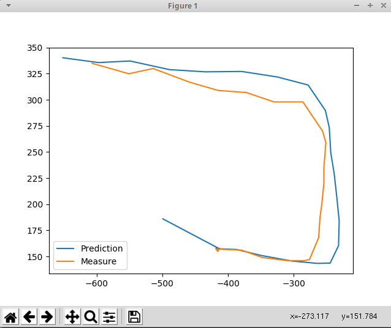

# Robot Position Prediction (Basics)

  In this one dimensional example we are using Kalman Filer approach to predict the next position of the moving robot.

# Car Location Prediction 2D - Constant Acceleration Model

  In this example we are predicting the position of a caar that has a constant acceleration. We have fixed lists of x and y measurements of the car in the 2D space. The rest of the equations are being derived. Finally, we plot the graph to see how the predictions become more acurate over time. 

# Jetbot Location Prediction - Constant Velocity Model

  (Code is stored in jetbot_Kalman folder)
  
  In this example, we will present 2D Kalman Filter while trying to predict the next position of a Jetbot on a test-pad (imitation of a road) using a camera for jetbot detection and getting the x and y measurements. Those measurements are imported into Kalman Filter and the predidction is being made.  

  There are many different motion models that can be bubilt for Kalman Filtering such as Constant Velocity (CV), Constant Acceleration (CA), Constant Turn (CT), Random Walk (RW) and many others. In this case we will use the constant velocity since the Jetbot is moving with a constant velocity. 
  
 The results of this project can be seen on the following graph:

&nbsp;&nbsp;&nbsp;&nbsp;&nbsp;&nbsp;&nbsp;&nbsp;&nbsp;&nbsp;&nbsp;&nbsp;&nbsp;&nbsp;&nbsp;&nbsp;&nbsp;&nbsp; 

  
Since this is not the Extended Kalman Filter, we can see that there is a deviation whenever the jetbot makes a turn. However, we can see that as  the jetbot keeps moving straight, the error between estimate and actual position is decreasing. 

Note: the x axis is inversed because I wanted graph to go from left to right. Camera is, on the other hand, seeing the car from right to left.
 <!-- 
 ### DISCRETE NOISE MODEL
 
  The discrete noise model assumes that the noise is different at each time period, but it is constant between time periods.
  
 
 
   -->
  
  
