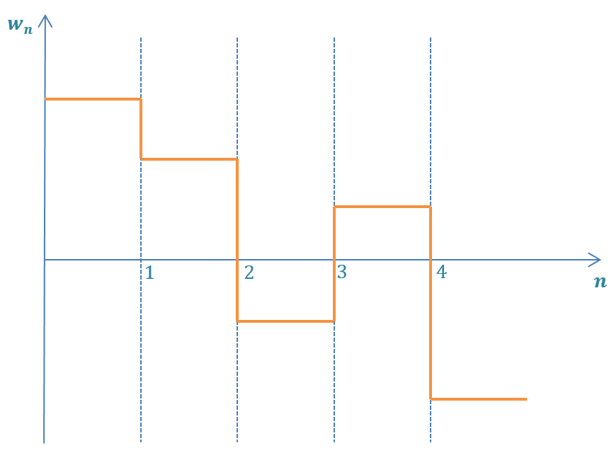

# Kalman_Filters
Different examples for applying Kalman Filers using Python.

# Introduction

Kalman Filter is treated as linear time-invariant (LTI) filter that is used to smoothen the noisy data and detrend the time-series signals. It can be considered as an optimization problem with objective of minimizing the smoothness of X_t (future state estimate) and minimizing the residual error between teh actual and smooth series. 

The process of estimating X_t is called **filtering or smoothing.**

The advantage of Kalman's Filter over [Wiener's Filter](https://en.wikipedia.org/wiki/Wiener_filter) is that the Kalman's Filter does not use all the previous states in order to predict the future state. It only uses the information of the previous state. This recursive solution is therefore much less computationally expensive.

# Robot Position Prediction (Basics)

  In this one dimensional example we are using Kalman Filer approach to predict the next position of the moving robot.

# Jetbot Location

  There are many different motion models that can be bubilt for Kalman Filtering such as Constant Velocity (CV), Constant Acceleration (CA), Constant Turn (CT), Random Walk (RW) and many others. In this case we will use the constant velocity since the Jetbot is moving with a constant velocity. 

 <1-- 
 ### DISCRETE NOISE MODEL
 
  The discrete noise model assumes that the noise is different at each time period, but it is constant between time periods.
  
 
 
   -->
  
  
